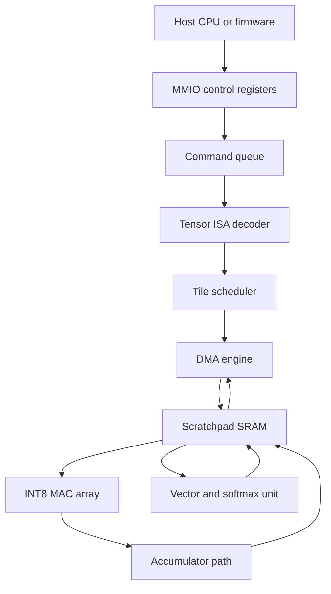

# System Architecture

## Intent

Define the first coherent top-level architecture for an attention-focused accelerator that can eventually live inside the Caravel user project area while remaining practical for early RTL, FPGA, and OpenLane work.

## Proposed top-level blocks

## Baseline architectural assumptions

| Topic | Planning assumption |
| --- | --- |
| Workload | attention-oriented matrix operations with tiled execution |
| Compute | fixed-function MAC array plus helper vector path |
| Storage | software-managed scratchpad rather than fully coherent cache |
| Control | host-programmed command queue backed by MMIO control/status |
| Integration | first as stand-alone RTL/FPGA target, then Caravel-integrated accelerator |

## Dataflow model

1. Software configures control registers and submits commands.
2. The command queue feeds the ISA decoder and scheduler.
3. The DMA engine pulls tensor tiles from host-visible memory into scratchpad banks.
4. The MAC array computes score and value transforms over scheduled tiles.
5. The vector path performs helper reductions and softmax-related work.
6. Results return to scratchpad and then to host memory.

## Architectural boundaries

- The accelerator owns local scheduling and scratchpad allocation for active tiles.
- The host owns global workload sequencing, buffer preparation, and completion handling.
- The golden model remains the numerical source of truth for correctness.
- Caravel integration should preserve the same logical programming model even if bus adapters change.

## Frozen baseline (Sprint 01)

The following parameters are frozen after architecture exploration:

| Parameter | Frozen value | Decision record |
| --- | --- | --- |
| Operand precision | INT8 | [ADR-0002](../decisions/ADR-0002-precision-policy.md) |
| Accumulator width | INT32 | [ADR-0002](../decisions/ADR-0002-precision-policy.md) |
| Tile shape | 64x64 | [ADR-0003](../decisions/ADR-0003-tile-shape.md) |
| Scratchpad capacity | 128 KiB, 8 banks, 32 slots | [ADR-0004](../decisions/ADR-0004-scratchpad-organization.md) |
| ISA surface | 8 opcodes, 64-bit descriptor | [Tensor ISA](tensor-isa.md) |
| Control model | MMIO command queue | [Tensor ISA](tensor-isa.md) |
| Target frequency | ~150 MHz on SKY130 | planning target, refined after synthesis |

## Open questions (carried to Sprint 02)

- How much softmax support should be hardwired versus sequenced through vector micro-ops? (Determines vector unit complexity.)
- What is the optimal MAC array width vs. routing on SKY130? (16 lanes is the planning target.)
- What bank arbiter backpressure contract minimizes stall cycles?
