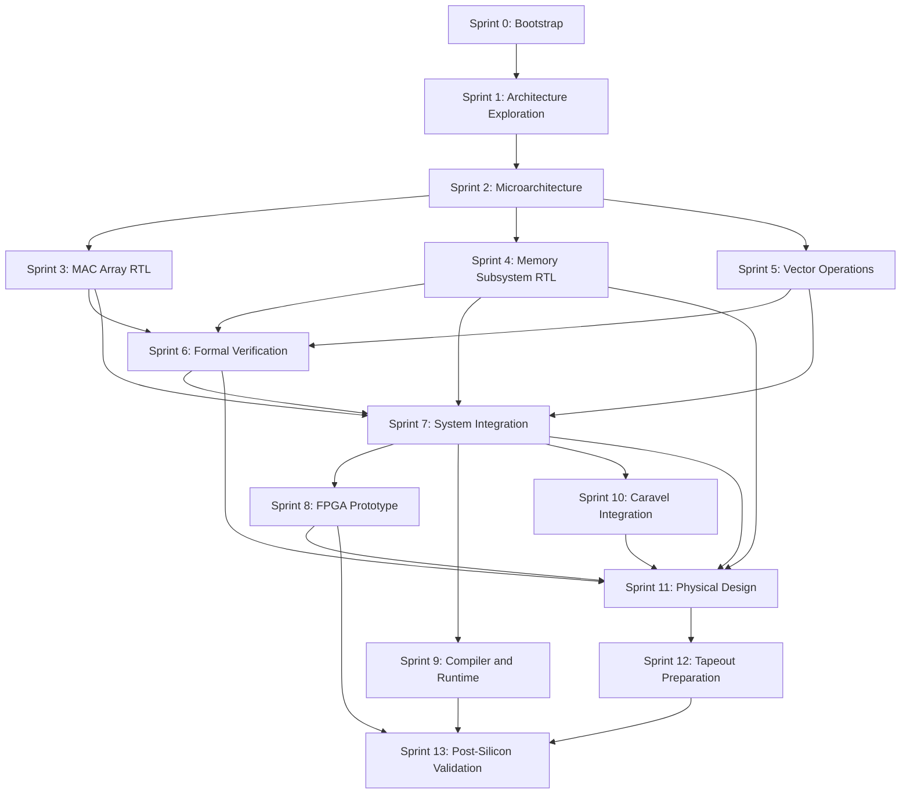

# Master Plan

## Mission

Deliver an open hardware transformer attention accelerator that can progress from architectural exploration to RTL, FPGA validation, Caravel integration, SKY130 physical implementation, tapeout, and post-silicon benchmarking.

This plan is anchored to the actual repository baseline documented in [Current State](current-state.md). The roadmap is intentionally ambitious, but each phase is written so progress can be measured with artifacts, reports, and verification evidence rather than intuition.

## Rebaseline

The original sprint structure is preserved, but the current repository state has changed the critical path.

The repo now has an integrated prototype with a real `LOAD_TILE -> MATMUL -> SOFTMAX -> STORE_TILE` path, stronger cocotb coverage, attached formal harnesses, and backend-relevant top-level collateral. That means the near-term program is no longer blocked on basic integration. It is now blocked on:

- solver-backed formal evidence,
- backend evidence on `attn_core`,
- a credible SRAM macro integration path,
- and expansion from score-path execution to fuller attention sequencing.

As a result, formal, FPGA/synthesis smoke, and physical-design evidence must run earlier and more iteratively than the original linear reading of the plan implied.

## Program principles

- Keep architecture work ahead of RTL so implementation follows measured decisions.
- Treat verification, formal, FPGA, and physical design as first-class workstreams rather than end-stage cleanup.
- Preserve reproducibility through the existing containerized environment and command entrypoints in [Makefile](../../Makefile).
- Separate current implementation truth from target architecture intent.

## Target baseline to validate in Sprint 1

| Parameter | Initial target |
| --- | --- |
| Data type | INT8 operands |
| Accumulator | INT16 or wider internal accumulation, finalized after numeric study |
| Compute organization | Tiled matrix-multiply engine optimized for attention |
| Scratchpad | 128 KiB class on-chip storage target |
| Tile shape | 64 x 64 baseline candidate |
| Control model | MMIO-configured command queue with tensor ISA |
| Performance target | Approximate 150 MHz class clock target on SKY130, refined after synthesis studies |

These values are planning anchors, not frozen commitments, until architecture exploration completes.

## End-to-end phase flow

## Phase summary

| Sprint | Theme | Primary outputs | Main dependency |
| --- | --- | --- | --- |
| [Sprint 00](sprints/sprint-00-bootstrap.md) | Repository bootstrap | docs structure, environment checks, CI expectations, baseline reports | current scaffold |
| [Sprint 01](sprints/sprint-01-architecture-exploration.md) | Architecture exploration | golden model expansion, tensor ISA, performance model, architecture freeze proposal | bootstrap evidence |
| [Sprint 02](sprints/sprint-02-microarchitecture.md) | Microarchitecture | block specs, interfaces, buffering plan, verification plan | architecture decisions |
| [Sprint 03](sprints/sprint-03-mac-array-rtl.md) | MAC RTL | lane and array RTL, unit tests, synthesis data | microarchitecture freeze |
| [Sprint 04](sprints/sprint-04-memory-subsystem-rtl.md) | Memory RTL | scratchpad, DMA, tile scheduler RTL, SRAM wrapper boundary, macro integration path | microarchitecture freeze |
| [Sprint 05](sprints/sprint-05-vector-operations.md) | Vector and softmax RTL | vector operations, softmax path, decoder logic | microarchitecture freeze |
| [Sprint 06](sprints/sprint-06-formal-verification.md) | Formal | property suites, proof harnesses, solver-backed proof runs, formal CI integration | core blocks implemented |
| [Sprint 07](sprints/sprint-07-system-integration.md) | Integration | `attn_core`, control plane, counters, baseline end-to-end regressions, follow-on full-attention closure | blocks + formal lessons |
| [Sprint 08](sprints/sprint-08-fpga-prototype.md) | FPGA | `08A`: synthesis/elaboration/debug smoke, `08B`: board wrapper, BRAM mapping, traces, demo workload | integrated core |
| [Sprint 09](sprints/sprint-09-compiler-runtime.md) | Compiler/runtime | `09A`: thin command generator/runtime, `09B`: broader lowering path and software driver model | integrated core |
| [Sprint 10](sprints/sprint-10-caravel-integration.md) | Caravel | wrapper, Wishbone interface, firmware tests, integration collateral | integrated core |
| [Sprint 11](sprints/sprint-11-physical-design.md) | Physical design | `11A`: pre-Caravel synthesis/floorplan/timing evidence on `attn_core`, `11B`: full PnR, timing, DRC/LVS reports | integrated core plus backend-relevant memory boundary |
| [Sprint 12](sprints/sprint-12-tapeout-preparation.md) | Tapeout prep | signoff packet, manifests, release evidence | physical closure |
| [Sprint 13](sprints/sprint-13-post-silicon.md) | Post-silicon | bring-up logs, benchmarks, release notes, next-rev backlog | fabricated silicon |

## Current Execution Priority

The immediate program priority is:

1. Close `Sprint 06` with real solver-backed formal results.
2. Advance `Sprint 11A` and `Sprint 08A` by collecting synthesis/OpenLane evidence on the integrated `attn_core` top.
3. Finish the remaining `Sprint 04` work needed for macro-backed memory realism.
4. Extend `Sprint 07` from baseline score-path integration toward fuller attention sequencing.
5. Start `Sprint 09A` with a minimal software/runtime path.
6. Keep `Sprint 10` planned, but not on the near-term critical path.

## Cross-cutting workstreams

Every sprint should identify work in these lanes whenever relevant:

- Architecture and modeling: golden model, numerics, bandwidth, performance estimation, and architecture trade studies.
- RTL and microarchitecture: SystemVerilog blocks, interfaces, scheduler/control, and implementation details.
- Verification and formal: cocotb, self-checking benches, assertions, SymbiYosys properties, and regression evidence.
- Software and compiler: firmware, register programming model, command generation, graph lowering, and runtime APIs.
- Integration and physical design: FPGA wrapper work, Caravel harnessing, OpenLane, timing, power, DRC/LVS, and packaging.
- Documentation and reporting: ADRs, sprint updates, run reports, design reviews, and decision logs.

## Major decision gates

- Architecture gate after Sprint 1: freeze baseline tile shape, precision strategy, and ISA surface.
- Microarchitecture gate after Sprint 2: freeze interfaces, buffering strategy, and scheduler responsibilities.
- Block readiness gate after Sprints 3 to 5: each major RTL block must have unit tests and preliminary implementation evidence.
- De-risking gate after the current integrated baseline: formal proofs must run with a real solver, backend tools must accept the top, and the memory system must expose a credible macro integration boundary.
- Integration gate after Sprint 7 follow-on closure: system-level control and dataflow must execute a fuller attention-oriented workload, not only the score path.
- Tapeout gate after Sprint 12: signoff evidence, packaging collateral, and regression archive must be complete.

## Success criteria

The program is successful when the following are all true:

- The accelerator executes attention-oriented tiled workloads with numerical agreement against the golden model.
- The software path can translate a supported model fragment into accelerator commands and drive execution.
- FPGA and simulation environments expose performance counters and reproducible benchmark evidence.
- Caravel integration is validated through control-path and firmware-driven tests.
- Physical-design artifacts reach a tapeout-ready state with timing, DRC, and LVS evidence recorded.
- Post-silicon validation reproduces at least one benchmarked attention inference demonstration.

## Main risks and mitigations

| Risk | Why it matters | Mitigation |
| --- | --- | --- |
| Architecture chosen too early | Early RTL can lock in poor area/bandwidth trade-offs | Require golden-model and performance-model evidence before interface freeze |
| Caravel constraints discovered late | Harness, area, and bus limits can invalidate earlier assumptions | Keep Caravel as a planned integration stream, but collect backend data on `attn_core` before depending on Caravel to unblock physical-design learning |
| Verification debt | Late system bugs are expensive to isolate | Attach unit, formal, and report outputs to each block sprint |
| Physical closure misses target | SKY130 area/timing can force architectural compromises | Start `Sprint 11A` backend evidence before full Caravel closure and before tapeout-focused sprints |
| Numerical mismatch | Softmax and quantization can drift from reference behavior | Build numeric study and bounded-error reporting into architecture and vector-unit work |

## Living links

- [Current State](current-state.md)
- [Architecture Docs](architecture/README.md)
- [Microarchitecture Docs](microarchitecture/README.md)
- [Sprint Plans](sprints/README.md)
- [Reports](reports/README.md)
- [Decisions](decisions/README.md)
