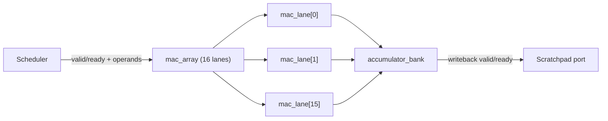

# Compute Datapath

Status: spec frozen (Sprint 02)

## Scope

This document defines the block-level specification for the MAC lane, MAC array, and accumulation path that implement tiled INT8 matrix-multiply with INT32 accumulation.

## Block decomposition

### `mac_lane` -- single multiply-accumulate unit

Each lane performs one INT8 x INT8 -> INT32 multiply-accumulate per cycle.

| Signal | Dir | Width | Description |
| --- | --- | --- | --- |
| `clk` | in | 1 | Clock |
| `rst_n` | in | 1 | Active-low synchronous reset |
| `op_valid` | in | 1 | Operand pair is valid |
| `op_a` | in | 8 | Signed INT8 multiplicand (from Q or weight row) |
| `op_b` | in | 8 | Signed INT8 multiplier (from K or V column) |
| `accum_clear` | in | 1 | Reset accumulator to zero before this cycle's MAC |
| `accum_out` | out | 32 | Current accumulator value |
| `lane_busy` | out | 1 | Pipeline contains in-flight data |

Pipeline structure (3 stages):
1. **Stage 1 -- Operand capture**: register `op_a` and `op_b` on `op_valid`.
2. **Stage 2 -- Multiply**: signed 8x8 -> 16-bit product.
3. **Stage 3 -- Accumulate**: add product to 32-bit accumulator with saturation.

Saturation: on signed overflow, clamp to INT32_MAX or INT32_MIN. The `accum_clear` signal resets the accumulator to zero before the current cycle's add, enabling back-to-back tile processing without pipeline flush.

### `mac_array` -- 16-lane coordination

The array processes one row of a tile per scheduling round. For a 64-wide tile with 16 lanes, each row completes in `ceil(64/16) = 4` cycles of operand delivery.

| Signal | Dir | Width | Description |
| --- | --- | --- | --- |
| `clk` | in | 1 | Clock |
| `rst_n` | in | 1 | Active-low synchronous reset |
| `tile_valid` | in | 1 | Scheduler presents a new tile operation |
| `tile_ready` | out | 1 | Array can accept a new tile |
| `tile_m` | in | 8 | Row count for this tile |
| `tile_n` | in | 8 | Column count for this tile |
| `tile_k` | in | 8 | Inner dimension (dot-product length) |
| `accum_mode` | in | 1 | 1 = add to existing accumulator, 0 = clear first |
| `a_data` | in | 128 | 16 x INT8 operands from scratchpad (A-side) |
| `b_data` | in | 128 | 16 x INT8 operands from scratchpad (B-side) |
| `a_valid` | in | 1 | A-side data valid |
| `b_valid` | in | 1 | B-side data valid |
| `result_data` | out | 512 | 16 x INT32 accumulated results |
| `result_valid` | out | 1 | Result row ready for writeback |
| `result_ready` | in | 1 | Downstream can accept result |
| `busy` | out | 1 | Array has in-flight work |

Tile-row sequencing:
1. Scheduler asserts `tile_valid` with tile dimensions and `accum_mode`.
2. Array pulls `a_data`/`b_data` from scratchpad port across K-dimension in chunks of 16.
3. After all K iterations for one output row, `result_valid` asserts.
4. If `result_ready` is low, the pipeline stalls (backpressure).
5. After M rows complete, `tile_ready` re-asserts for the next tile.

### Accumulator writeback path

The writeback path formats INT32 accumulator outputs for scratchpad storage.

| Signal | Dir | Width | Description |
| --- | --- | --- | --- |
| `accum_in` | in | 512 | 16 x INT32 from mac_array |
| `accum_valid` | in | 1 | Data valid |
| `shift_amount` | in | 4 | Right-shift for scaling (0-15) |
| `saturate_to_8` | in | 1 | Saturate result to INT8 range |
| `wb_data` | out | 128 | 16 x INT8 (if saturated) or partial INT32 |
| `wb_valid` | out | 1 | Write data ready |
| `wb_ready` | in | 1 | Scratchpad port can accept write |
| `wb_addr` | out | 17 | Scratchpad byte address (17 bits for 128 KiB) |

The shift-then-saturate pipeline is 1 cycle: right-shift by `shift_amount`, then clamp to [-128, 127] if `saturate_to_8` is set.

## Partial-sum lifetime and reset semantics

- Accumulators persist across K-dimension iterations within one tile.
- `accum_clear` fires on the first K-chunk of each output row unless `accum_mode` is set.
- When `accum_mode = 1` (MATMUL with accumulate flag), existing accumulator values are preserved, enabling multi-tile accumulation for tiles that span the K dimension.
- On tile completion, accumulators are invalid until the next `tile_valid`.

## Critical timing paths

1. **Multiplier -> adder -> accumulator register**: the 8x8 signed multiply produces a 16-bit product; adding to a 32-bit accumulator with saturation check is the longest combinational path in `mac_lane`. Target: 1 cycle at 150 MHz on SKY130.
2. **Operand fanout**: `a_data` and `b_data` fan out to 16 lanes. Pipeline register at the array input absorbs routing delay.
3. **Writeback backpressure**: `result_ready` feeds back into the pipeline stall chain. Must be registered to avoid combinational loops with scratchpad arbitration.

## Parameterization

| Parameter | Default | Rationale |
| --- | --- | --- |
| `NUM_LANES` | 16 | Balances throughput vs. routing; processes 64-wide row in 4 cycles |
| `OPERAND_WIDTH` | 8 | INT8 per ADR-0002 |
| `ACCUM_WIDTH` | 32 | INT32 per ADR-0002 |
| `PIPE_STAGES` | 3 | Matches `HardwareConfig.mac_pipe_stages` in performance model |

`NUM_LANES` is the primary parameter likely to change after synthesis area feedback.

## Verification plan

| Test category | Method | Sprint |
| --- | --- | --- |
| Single-lane multiply correctness | Directed cocotb: boundary values (0, 1, -1, 127, -128) | 03 |
| Accumulation and saturation | Directed cocotb: overflow, underflow, clear, persist | 03 |
| Array tile sequencing | Directed cocotb: 4x4, 16x16, 64x64 tiles | 03 |
| Backpressure stall/resume | Constrained-random: toggle `result_ready` | 03 |
| Accumulator overflow | Formal: assert output always in INT32 range | 06 |
| Multi-tile accumulate mode | Directed cocotb: back-to-back tiles with `accum_mode=1` | 03 |
| Synthesis timing | Yosys/OpenSTA spot check at 150 MHz | 03 |
