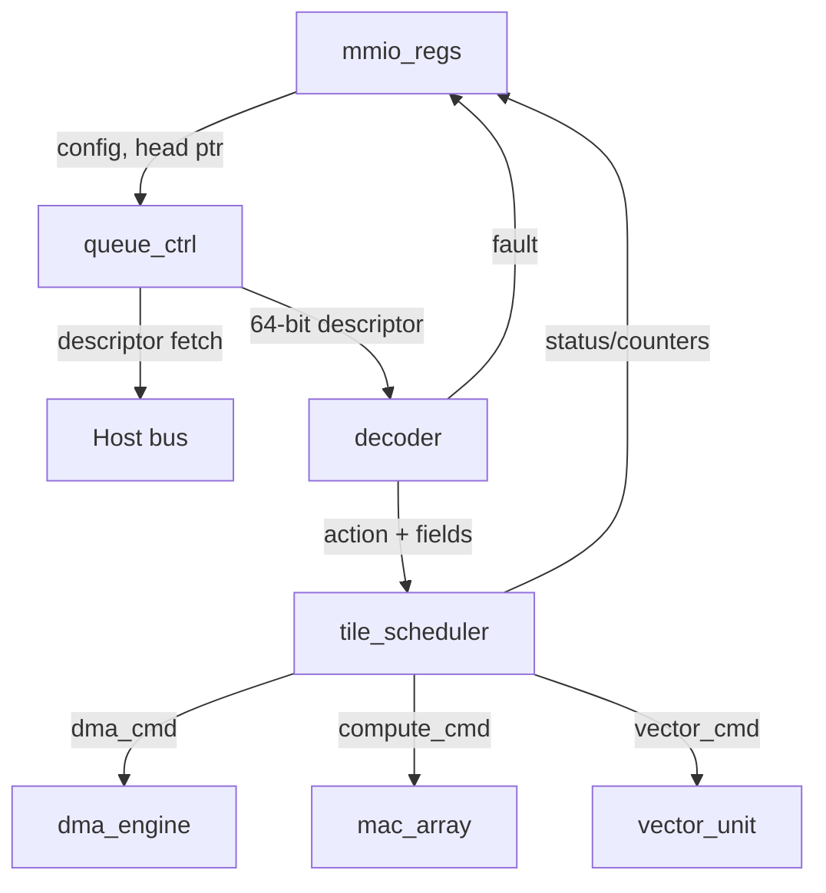
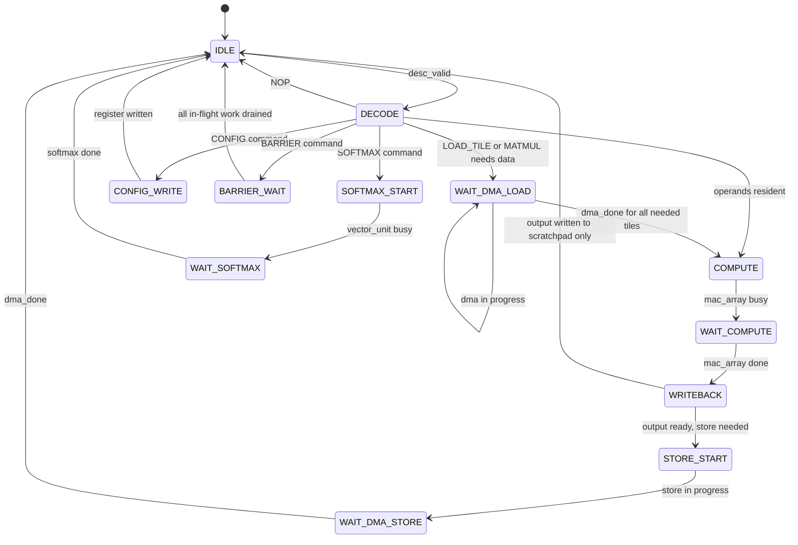

# Control Plane

Status: spec frozen (Sprint 02)

## Scope

Define the instruction decoder, command queue consumer, tile scheduler, and software-visible MMIO registers. All opcode and register definitions derive from the frozen tensor ISA.

## Block decomposition

## Decoder (`decoder`)

### Function

Decode one 64-bit command descriptor per cycle into a scheduler action or a fault.

### Decode table

| Opcode | Action output | Fields consumed |
| --- | --- | --- |
| `NOP` (0x00) | No action; advance queue tail | none |
| `LOAD_TILE` (0x01) | `dma_cmd` with `load=1` | `dst_tile_id`, `dim_m`, `dim_n`, flags[7] burst |
| `STORE_TILE` (0x02) | `dma_cmd` with `load=0` | `src_tile_id`, `dim_m`, `dim_n`, flags[7] burst |
| `MATMUL` (0x03) | `compute_cmd` | `src_tile_id`, `dst_tile_id`, `dim_m`, `dim_n`, `dim_k`, flags[7] accum, flags[6] saturate |
| `ACCUMULATE` (0x04) | `compute_cmd` with reduction mode | `src_tile_id`, `dst_tile_id`, flags[7] reset_after, flags[3:0] reduction_mode |
| `SOFTMAX` (0x05) | `vector_cmd` | `src_tile_id`, `dst_tile_id`, `dim_m`, `dim_n`, flags[7] approx_mode |
| `CONFIG` (0x06) | `config_write` to MMIO | flags[3:0] register_id, `dim_m` as value[7:0], `dim_n` as value[15:8] |
| `BARRIER` (0x07) | Stall until in-flight work drains | flags[7] flush_queue, flags[3:0] scope |
| 0x08-0xFF | `fault` | opcode captured in `FAULT_INFO` |

### Fault detection pipeline (1 cycle)

Priority-ordered checks on each descriptor:
1. `reserved[3:0] != 0` -> fault cause `RESERVED_FIELD`
2. `opcode > 0x07` -> fault cause `INVALID_OPCODE`
3. `dst_tile_id >= 32` or `src_tile_id >= 32` (where applicable) -> fault cause `TILE_OOB`

On fault: set `FAULT_INFO`, set fault bit in `STATUS`, halt queue consumption. Software must clear via `CTRL` before the queue resumes.

### Decoder interface

| Signal | Dir | Width | Description |
| --- | --- | --- | --- |
| `clk` | in | 1 | Clock |
| `rst_n` | in | 1 | Active-low synchronous reset |
| `desc_valid` | in | 1 | Descriptor available from queue controller |
| `desc_data` | in | 64 | Raw command descriptor |
| `desc_consumed` | out | 1 | Descriptor accepted (advance tail) |
| `action_type` | out | 3 | One-hot: {dma, compute, vector, config, barrier, nop, fault} |
| `action_fields` | out | 56 | Parsed fields passed to scheduler |
| `fault_valid` | out | 1 | Fault detected |
| `fault_cause` | out | 2 | 00=reserved_field, 01=invalid_opcode, 10=tile_oob |
| `fault_descriptor` | out | 64 | Faulting descriptor for `FAULT_INFO` |

## Command queue controller (`queue_ctrl`)

### Function

Manage the host-memory command ring: fetch descriptors between `CMD_TAIL` and `CMD_HEAD`, deliver them to the decoder.

### Behavior

- Queue base address and size are set by software via `CMD_QUEUE_BASE` and `CMD_QUEUE_SIZE` MMIO registers.
- `CMD_HEAD` is written by software (producer). `CMD_TAIL` is advanced by hardware (consumer).
- Queue depth is power-of-2, max 256 entries of 8 bytes each (2 KiB max ring).
- When `CMD_TAIL == CMD_HEAD`, queue is empty; controller idles.
- When fault is active, controller halts and does not fetch.
- Fetch is one descriptor per cycle via the host bus interface.

### Interface

| Signal | Dir | Width | Description |
| --- | --- | --- | --- |
| `clk` | in | 1 | Clock |
| `rst_n` | in | 1 | Active-low synchronous reset |
| `queue_base` | in | 32 | From `CMD_QUEUE_BASE` register |
| `queue_size_log2` | in | 4 | From `CMD_QUEUE_SIZE` register (max 8 = 256 entries) |
| `head` | in | 8 | From `CMD_HEAD` register (producer pointer) |
| `tail` | out | 8 | To `CMD_TAIL` register (consumer pointer) |
| `fault_halt` | in | 1 | Halt on active fault |
| `desc_valid` | out | 1 | Fetched descriptor available |
| `desc_data` | out | 64 | Fetched descriptor |
| `desc_consumed` | in | 1 | Decoder accepted descriptor |
| `bus_req` | out | 1 | Host bus request for descriptor fetch |
| `bus_addr` | out | 32 | Host bus address |
| `bus_rdata` | in | 64 | Host bus read data |
| `bus_ack` | in | 1 | Host bus acknowledge |

## Tile scheduler (`tile_scheduler`)

### Function

Sequence DMA loads, MAC compute, softmax, and DMA stores for each tile operation, respecting data dependencies and resource availability.

### State machine

### Scheduler interface

| Signal | Dir | Width | Description |
| --- | --- | --- | --- |
| `action_type` | in | 3 | From decoder |
| `action_fields` | in | 56 | From decoder |
| `dma_cmd_valid` | out | 1 | Issue DMA command |
| `dma_cmd_ready` | in | 1 | DMA ready |
| `dma_cmd_*` | out | varies | DMA command fields (load, slot, addr, bytes) |
| `dma_done` | in | 1 | DMA transfer complete |
| `compute_cmd_valid` | out | 1 | Issue MAC array command |
| `compute_cmd_ready` | in | 1 | MAC array ready |
| `compute_cmd_*` | out | varies | MAC command fields (src, dst, dims, accum_mode) |
| `compute_done` | in | 1 | MAC array tile complete |
| `vector_cmd_valid` | out | 1 | Issue vector/softmax command |
| `vector_cmd_ready` | in | 1 | Vector unit ready |
| `vector_cmd_*` | out | varies | Vector command fields (src, dst, dims, approx) |
| `vector_done` | in | 1 | Vector unit complete |
| `slot_state` | in/out | 64 | 32 x 2-bit residency state (see memory-subsystem.md) |
| `busy` | out | 1 | Scheduler has active work |

### Dependency tracking

The scheduler enforces dependencies through tile slot state:
- `LOAD_TILE` transitions slot from `FREE` -> `LOADING` -> `RESIDENT`.
- `MATMUL`/`SOFTMAX` require source slots to be `RESIDENT`.
- `STORE_TILE` transitions slot from `RESIDENT` -> `STORING` -> `FREE`.
- `BARRIER` stalls until all slots in scope have completed their current operation.

## MMIO register behavior

All registers from the frozen ISA register map, with per-field read/write semantics:

| Offset | Name | Reset | Read behavior | Write behavior |
| --- | --- | --- | --- | --- |
| 0x00 | `CTRL` | 0 | Return current value | bit[0] = global_enable, bit[1] = soft_reset, bit[2] = fault_clear, bit[3] = irq_mask |
| 0x04 | `STATUS` | 0 | bit[0] = busy, bit[1] = fault, bit[7:4] = queue_depth | Read-only |
| 0x08 | `CMD_QUEUE_BASE` | 0 | Return configured base | Set queue ring base address |
| 0x0C | `CMD_QUEUE_SIZE` | 0 | Return configured size | Set log2(depth), max 8 |
| 0x10 | `CMD_HEAD` | 0 | Return head pointer | Software advances producer pointer |
| 0x14 | `CMD_TAIL` | 0 | Return tail pointer | Read-only (hardware advances) |
| 0x18 | `FAULT_INFO` | 0 | {cause[1:0], opcode[7:0], descriptor[63:0]} | Read-only (cleared by fault_clear) |
| 0x1C | `TILE_DEFAULT_M` | 64 | Return default M | Set default tile M |
| 0x20 | `TILE_DEFAULT_N` | 64 | Return default N | Set default tile N |
| 0x24 | `TILE_DEFAULT_K` | 64 | Return default K | Set default tile K |
| 0x28 | `PERF_BUSY_CYCLES` | 0 | Return counter | Read-only (cleared on soft_reset) |
| 0x2C | `PERF_STALL_CYCLES` | 0 | Return counter | Read-only (cleared on soft_reset) |
| 0x30 | `PERF_DMA_BYTES` | 0 | Return counter | Read-only (cleared on soft_reset) |
| 0x34 | `PERF_TILE_COUNT` | 0 | Return counter | Read-only (cleared on soft_reset) |
| 0x38 | `DMA_HOST_ADDR` | 0 | Return address | Set host address for direct-mode transfers |
| 0x3C | `SCRATCH_BASE` | 0 | Return base | Set scratchpad base for direct-mode |

## Verification plan

| Test category | Method | Sprint |
| --- | --- | --- |
| Decoder: all 8 opcodes | Directed cocotb: one descriptor per opcode | 05 |
| Decoder: fault on invalid opcode | Directed cocotb: opcode 0x08, 0xFF | 05 |
| Decoder: fault on reserved field | Directed cocotb: reserved != 0 | 05 |
| Decoder: fault on OOB tile ID | Directed cocotb: slot_id = 32 | 05 |
| Queue: empty/full/wrap | Directed cocotb: head/tail cycling | 05 |
| Queue: fault halts consumption | Directed cocotb: inject fault, verify tail frozen | 05 |
| Scheduler: IDLE -> COMPUTE -> IDLE | Directed cocotb: MATMUL on resident tiles | 07 |
| Scheduler: full attention sequence | Directed cocotb: LOAD, MATMUL, SOFTMAX, STORE | 07 |
| Scheduler: BARRIER drains in-flight | Directed cocotb: commands then BARRIER | 07 |
| Scheduler liveness | Formal: no deadlock (every state has enabled exit) | 06 |
| MMIO register model | Directed cocotb: write/read all registers | 05 |
