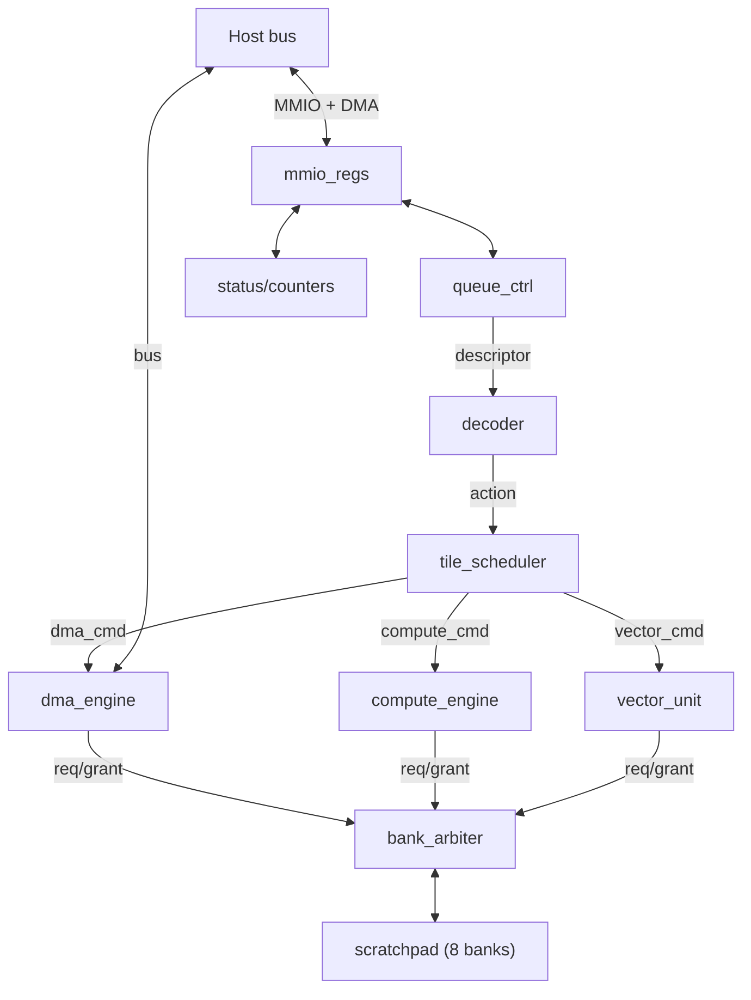

# Block Interface Definitions

Status: spec frozen (Sprint 02)

## Purpose

Consolidated signal-level interface definitions between all major blocks. Each interface is owned by the block that drives the `valid` or `req` signal. The receiving block drives `ready` or `grant`.

## System-level interconnect

## Interface 1: Decoder -> Scheduler

Owner: decoder
Consumer: tile_scheduler

| Signal | Dir | Width | Description |
| --- | --- | --- | --- |
| `action_valid` | D->S | 1 | Decoded action available |
| `action_ready` | S->D | 1 | Scheduler can accept action |
| `action_type` | D->S | 3 | Encoded: 0=nop, 1=dma, 2=compute, 3=vector, 4=config, 5=barrier, 6=fault |
| `action_load` | D->S | 1 | For DMA: 1=load, 0=store |
| `action_src_slot` | D->S | 5 | Source tile slot ID |
| `action_dst_slot` | D->S | 5 | Destination tile slot ID |
| `action_dim_m` | D->S | 8 | Tile M dimension (0 = use default) |
| `action_dim_n` | D->S | 8 | Tile N dimension (0 = use default) |
| `action_dim_k` | D->S | 8 | Tile K dimension for MATMUL |
| `action_flags` | D->S | 8 | Per-opcode flags (accum, saturate, burst, approx, etc.) |
| `action_tag` | D->S | 4 | Completion tag |

Handshake: standard valid/ready. Decoder holds outputs stable until `action_ready` asserts.

## Interface 2: Scheduler -> DMA engine

Owner: tile_scheduler
Consumer: dma_engine

| Signal | Dir | Width | Description |
| --- | --- | --- | --- |
| `dma_cmd_valid` | S->D | 1 | DMA command issued |
| `dma_cmd_ready` | D->S | 1 | DMA can accept |
| `dma_cmd_load` | S->D | 1 | 1=host->scratch, 0=scratch->host |
| `dma_cmd_host_addr` | S->D | 32 | Host-side byte address |
| `dma_cmd_slot_id` | S->D | 5 | Scratchpad tile slot |
| `dma_cmd_byte_count` | S->D | 13 | Transfer size (up to 4096) |
| `dma_done` | D->S | 1 | Transfer complete pulse |
| `dma_error` | D->S | 1 | Fault pulse |

## Interface 3: Scheduler -> Compute engine

Owner: tile_scheduler
Consumer: compute_engine

| Signal | Dir | Width | Description |
| --- | --- | --- | --- |
| `compute_cmd_valid` | S->M | 1 | Compute command issued |
| `compute_cmd_ready` | M->S | 1 | Compute engine can accept |
| `compute_src_slot` | S->M | 5 | Source A tile slot |
| `compute_src2_slot` | S->M | 5 | Prefetched RHS tile slot |
| `compute_dst_slot` | S->M | 5 | Destination tile slot |
| `compute_dim_m` | S->M | 8 | Tile M dimension |
| `compute_dim_n` | S->M | 8 | Tile N dimension |
| `compute_dim_k` | S->M | 8 | Inner dimension |
| `compute_accum` | S->M | 1 | Reserved for future accumulation path |
| `compute_saturate` | S->M | 1 | Saturate output to INT8 |
| `compute_shift` | S->M | 4 | Right-shift amount |
| `compute_done` | M->S | 1 | Tile complete pulse |

Current integrated profile: the scheduler drives `compute_src2_slot` and `compute_dst_slot` from the same descriptor field. The compute engine prefetches the RHS tile before writing the output tile back in-place.

## Interface 4: Scheduler -> Vector unit

Owner: tile_scheduler
Consumer: vector_unit

| Signal | Dir | Width | Description |
| --- | --- | --- | --- |
| `vector_cmd_valid` | S->V | 1 | Vector command issued |
| `vector_cmd_ready` | V->S | 1 | Vector unit can accept |
| `vector_src_slot` | S->V | 5 | Source tile slot (INT8 score bytes) |
| `vector_dst_slot` | S->V | 5 | Destination tile slot (INT8 normalized weights) |
| `vector_rows` | S->V | 8 | Number of rows |
| `vector_cols` | S->V | 8 | Number of columns per row |
| `vector_approx` | S->V | 1 | Approximation mode |
| `vector_done` | V->S | 1 | All rows complete pulse |

## Interface 5: Scratchpad arbitrated port (per bank)

Owner: bank_arbiter
Consumer: scratchpad bank

Three requesters (DMA, MAC, vector) share each bank through the arbiter. The arbiter presents a single-port interface to each bank.

| Signal | Dir | Width | Description |
| --- | --- | --- | --- |
| `bank_en` | Arb->Bank | 1 | Access enable |
| `bank_wen` | Arb->Bank | 1 | Write enable |
| `bank_addr` | Arb->Bank | 14 | Bank-local byte address |
| `bank_wdata` | Arb->Bank | 8 | Write data |
| `bank_rdata` | Bank->Arb | 8 | Read data (1-cycle latency) |

### Requester -> Arbiter (per requester, per bank)

| Signal | Dir | Width | Description |
| --- | --- | --- | --- |
| `req` | Req->Arb | 1 | Bank access requested |
| `addr` | Req->Arb | 14 | Bank-local address |
| `wen` | Req->Arb | 1 | Write enable |
| `wdata` | Req->Arb | 8 | Write data |
| `grant` | Arb->Req | 1 | Request granted this cycle |
| `rdata` | Arb->Req | 8 | Read data (valid cycle after grant) |

## Interface 6: MMIO registers

Owner: host bus
Consumer: mmio_regs module

| Signal | Dir | Width | Description |
| --- | --- | --- | --- |
| `mmio_addr` | Host->MMIO | 6 | Register offset (64 bytes = 16 registers x 4 bytes) |
| `mmio_wen` | Host->MMIO | 1 | Write enable |
| `mmio_wdata` | Host->MMIO | 32 | Write data |
| `mmio_rdata` | MMIO->Host | 32 | Read data |
| `mmio_valid` | Host->MMIO | 1 | Access valid |
| `mmio_ready` | MMIO->Host | 1 | Access complete |

Internal connections from mmio_regs to other blocks:

| Output from MMIO | Consumer | Description |
| --- | --- | --- |
| `ctrl_enable` | tile_scheduler | Global enable bit |
| `ctrl_soft_reset` | all blocks | Synchronous soft reset |
| `ctrl_fault_clear` | decoder | Clear fault state |
| `queue_base` | queue_ctrl | Command ring base address |
| `queue_size_log2` | queue_ctrl | Ring depth |
| `cmd_head` | queue_ctrl | Producer pointer |
| `tile_default_m/n/k` | decoder | Default dimensions |
| `dma_host_addr` | tile_scheduler / dma_engine | Base host address for queued DMA slot windows |
| `scratch_base` | dma_engine | Reserved for future direct-mode transfers |

| Input to MMIO | Source | Description |
| --- | --- | --- |
| `cmd_tail` | queue_ctrl | Consumer pointer |
| `status_busy` | tile_scheduler | Busy flag |
| `status_fault` | decoder | Fault flag |
| `status_dma_active` | dma_engine | DMA active flag |
| `status_compute_active` | compute_engine | Compute active flag |
| `status_queue_depth` | queue_ctrl | Queue occupancy |
| `fault_info` | decoder | Fault cause + descriptor |
| `perf_busy_cycles` | tile_scheduler | Counter value |
| `perf_stall_cycles` | tile_scheduler | Counter value |
| `perf_dma_bytes` | dma_engine | Counter value |
| `perf_tile_count` | tile_scheduler | Counter value |

## Interface 7: DMA -> Host bus

Owner: dma_engine
Consumer: host bus

| Signal | Dir | Width | Description |
| --- | --- | --- | --- |
| `bus_req` | DMA->Host | 1 | Bus cycle request |
| `bus_addr` | DMA->Host | 32 | Host byte address |
| `bus_wen` | DMA->Host | 1 | Write enable |
| `bus_wdata` | DMA->Host | 128 | 16-byte write data |
| `bus_rdata` | Host->DMA | 128 | 16-byte read data |
| `bus_ack` | Host->DMA | 1 | Cycle acknowledge |

This interface maps to Wishbone Classic via a bridge module in Sprint 10.

## Global signals

All blocks share:

| Signal | Width | Description |
| --- | --- | --- |
| `clk` | 1 | Single system clock (~150 MHz) |
| `rst_n` | 1 | Active-low synchronous reset |

## Handshake conventions

1. **Valid/ready**: sender asserts `valid` and holds data stable. Receiver asserts `ready` when it can accept. Transfer occurs on the cycle when both are high.
2. **Request/grant**: sender asserts `req` with address/data and holds until `grant`. Transfer occurs on the `grant` cycle. Read data is valid on the cycle after `grant`.
3. **Pulse signals**: `done`, `error`, and similar are asserted for exactly one cycle.
