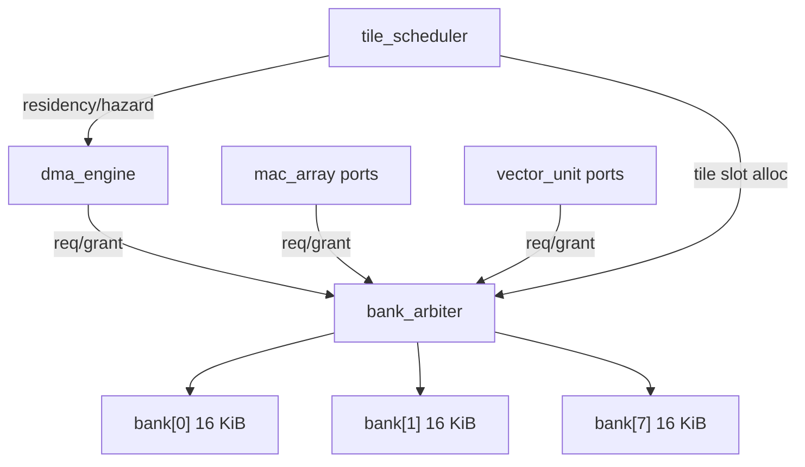

# Memory Subsystem

Status: spec frozen (Sprint 02)

## Scope

Cover the scratchpad, DMA engine, bank arbiter, and memory-facing portions of the tile scheduler. All parameters derive from ADR-0004 (128 KiB, 8 banks, 32 tile slots).

## Block decomposition

## Scratchpad (`scratchpad`)

### Organization

| Parameter | Value | Source |
| --- | --- | --- |
| Total capacity | 131,072 bytes (128 KiB) | ADR-0004 |
| Banks | 8 | ADR-0004 |
| Bank size | 16,384 bytes (16 KiB) | 128 KiB / 8 |
| Tile slots | 32 | ADR-0004 |
| Bytes per tile slot | 4,096 (4 KiB) | 64 x 64 x 1 byte |
| Address width | 17 bits | log2(131072) |
| Bank select | bits [16:14] of byte address | 3 bits for 8 banks |
| Bank offset | bits [13:0] of byte address | 14 bits for 16 KiB |

### Port interface (per bank)

| Signal | Dir | Width | Description |
| --- | --- | --- | --- |
| `clk` | in | 1 | Clock |
| `en` | in | 1 | Access enable |
| `wen` | in | 1 | Write enable (0 = read) |
| `addr` | in | 14 | Bank-local byte address |
| `wdata` | in | 8 | Write data (INT8) |
| `rdata` | out | 8 | Read data (1-cycle latency) |

For burst access the MAC array and DMA read/write 16 bytes per cycle (one lane-width). The bank interface is replicated across banks; the arbiter ensures only one requester accesses a given bank per cycle.

### Implementation path

- **RTL bring-up**: behavioral SRAM (`reg [7:0] mem [0:16383]`).
- **ASIC**: OpenRAM single-port SRAM macros, one per bank.

## Bank arbiter (`bank_arbiter`)

Three requesters share 8 banks. The arbiter resolves per-bank conflicts each cycle using fixed priority.

| Priority | Requester | Rationale |
| --- | --- | --- |
| Highest | DMA engine | Stalling DMA wastes bus bandwidth |
| Medium | MAC array | Compute is the throughput bottleneck |
| Lowest | Vector unit | Softmax is latency-tolerant |

### Arbiter interface

| Signal | Dir | Width | Description |
| --- | --- | --- | --- |
| `dma_req` | in | 8 | Per-bank request bitmap from DMA |
| `dma_addr` | in | 8x14 | Per-bank address from DMA |
| `dma_wen` | in | 8 | Per-bank write-enable from DMA |
| `dma_wdata` | in | 8x8 | Per-bank write data from DMA |
| `dma_grant` | out | 8 | Per-bank grant bitmap to DMA |
| `dma_rdata` | out | 8x8 | Per-bank read data to DMA |
| `mac_req` | in | 8 | Per-bank request bitmap from MAC |
| `mac_addr` | in | 8x14 | Per-bank address from MAC |
| `mac_wen` | in | 8 | Per-bank write-enable from MAC |
| `mac_wdata` | in | 8x8 | Per-bank write data from MAC |
| `mac_grant` | out | 8 | Per-bank grant bitmap to MAC |
| `mac_rdata` | out | 8x8 | Per-bank read data to MAC |
| `vec_req` | in | 8 | Per-bank request bitmap from vector |
| `vec_addr` | in | 8x14 | Per-bank address from vector |
| `vec_wen` | in | 8 | Per-bank write-enable from vector |
| `vec_wdata` | in | 8x8 | Per-bank write data from vector |
| `vec_grant` | out | 8 | Per-bank grant bitmap to vector |
| `vec_rdata` | out | 8x8 | Per-bank read data to vector |

Backpressure model: if a requester's bank request is not granted, the requester must hold its request stable until granted (stall-based, no retry).

## DMA engine (`dma_engine`)

### Responsibilities

- Transfer tiles between host-visible memory and scratchpad slots.
- One transfer at a time (no scatter/gather in first implementation).
- 16 bytes per cycle burst rate (matching MAC lane width).
- Bounds checking: reject tile slot IDs >= 32.

### Interface to scheduler

| Signal | Dir | Width | Description |
| --- | --- | --- | --- |
| `clk` | in | 1 | Clock |
| `rst_n` | in | 1 | Active-low synchronous reset |
| `cmd_valid` | in | 1 | Scheduler issues a DMA command |
| `cmd_ready` | out | 1 | DMA can accept a command |
| `cmd_load` | in | 1 | 1 = load (host -> scratch), 0 = store (scratch -> host) |
| `cmd_host_addr` | in | 32 | Host-side byte address |
| `cmd_slot_id` | in | 5 | Scratchpad tile slot (0-31) |
| `cmd_byte_count` | in | 13 | Transfer size (up to 4096) |
| `done` | out | 1 | Transfer complete pulse |
| `error` | out | 1 | Fault pulse (OOB slot, bus error) |
| `bytes_moved` | out | 32 | Running counter for `PERF_DMA_BYTES` |

### Interface to host bus

| Signal | Dir | Width | Description |
| --- | --- | --- | --- |
| `bus_req` | out | 1 | Bus request |
| `bus_addr` | out | 32 | Host address |
| `bus_wen` | out | 1 | Write enable |
| `bus_wdata` | out | 128 | 16-byte write data |
| `bus_rdata` | in | 128 | 16-byte read data |
| `bus_ack` | in | 1 | Bus cycle acknowledge |

For Caravel integration (Sprint 10), this interface adapts to Wishbone with a thin bridge module.

### Transfer sequencing

1. Scheduler asserts `cmd_valid` with slot, host address, and byte count.
2. DMA computes `scratch_base = cmd_slot_id * 4096`.
3. DMA iterates in 16-byte bursts: `ceil(cmd_byte_count / 16)` bus cycles.
4. On each burst, DMA issues a bank request to the arbiter for the target bank.
5. On completion, `done` pulses for one cycle.
6. On fault (slot >= 32, bus error), `error` pulses and the transfer aborts.

## Tile residency tracking

The scheduler maintains a 32-bit residency bitmap and a per-slot state:

| Slot state | Encoding | Meaning |
| --- | --- | --- |
| `FREE` | 2'b00 | Slot available for allocation |
| `LOADING` | 2'b01 | DMA load in progress |
| `RESIDENT` | 2'b10 | Data valid for compute/vector access |
| `STORING` | 2'b11 | DMA store in progress |

Hazard tracking:
- **Read-after-write**: compute/vector cannot read a slot in `LOADING` state. Scheduler stalls until `RESIDENT`.
- **Write-after-read**: store cannot begin while compute/vector is reading the slot. Scheduler tracks active readers per slot (1-bit counter sufficient for non-overlapping phases).
- **Write-after-write**: a slot cannot be re-loaded while a store is in progress. Scheduler stalls until `FREE`.

## Formal targets

| Property | Description | Sprint |
| --- | --- | --- |
| No OOB access | `cmd_slot_id < 32` on every `cmd_valid` | 06 |
| No bank select overflow | `bank_idx < 8` on every granted access | 06 |
| DMA completes | Every accepted command eventually asserts `done` or `error` | 06 |
| No hazard violation | Compute never reads a `LOADING` slot | 06 |
| No deadlock | Scheduler never enters a state with no enabled transitions | 06 |

## Verification plan

| Test category | Method | Sprint |
| --- | --- | --- |
| Single-bank read/write | Directed cocotb | 04 |
| Multi-bank concurrent access | Directed cocotb with 3 requesters | 04 |
| Arbiter priority enforcement | Directed cocotb: simultaneous requests, verify DMA wins | 04 |
| DMA full-tile transfer | Directed cocotb: load 4096 bytes, verify scratchpad contents | 04 |
| DMA OOB fault | Directed cocotb: slot_id = 32, expect error | 04 |
| Tile residency FSM | Directed cocotb: FREE -> LOADING -> RESIDENT -> STORING -> FREE | 04 |
| Backpressure stall | Constrained-random: hold arbiter grant low, verify no data loss | 04 |
| Synthesis spot check | Yosys/OpenSTA at 150 MHz | 04 |
