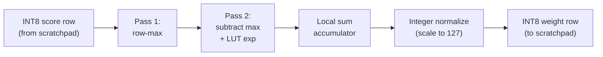

# Vector and Softmax

Status: implemented baseline (Sprint 05 + de-risking update)

## Scope

The integrated vector unit performs row-wise softmax over **INT8 score tiles already resident in scratchpad** and writes **INT8 fixed-point weights** back to scratchpad. This matches the current 4 KiB slot model and avoids the earlier INT32-per-element storage mismatch.

The output format is a non-negative 8-bit value whose row sum is approximately `127`. That format is intended for the current integrated bring-up path, not as the final tapeout-quality attention weight representation.

## Implemented decomposition

## Per-row behavior

### Pass 1: Row-max

- Reads one score byte at a time from scratchpad.
- Tracks the maximum value across the row.
- Consumes the scratchpad through the standard request/grant interface, with read data valid one cycle after `grant`.

### Pass 2: Exponent approximation

- Re-reads the row after the maximum is known.
- Computes `shifted = score - row_max`.
- Maps `shifted` through a small integer LUT:
  - `exp(0)` -> `256`
  - `exp(-1)` -> `94`
  - `exp(-2)` -> `35`
  - `exp(-3)` -> `13`
  - `exp(-4)` -> `5`
  - `exp(-5)` -> `2`
  - `exp(-6)` -> `1`
  - values below `-6` clamp to `0`
- Buffers one row of approximate exp values locally in `exp_buf[64]`.

### Pass 3: Normalize and store

- Accumulates a 32-bit `row_sum` across the buffered exp values.
- Computes each output weight as:
  - `weight = round(exp_value * 127 / row_sum)`
- Writes the normalized byte stream to the destination slot, one byte at a time.

## Local storage

| Register | Width | Count | Purpose |
| --- | --- | --- | --- |
| `row_max` | 9 | 1 | Current row max |
| `row_sum` | 32 | 1 | Sum of approximate exp values |
| `exp_buf` | 16 | 64 | Buffered per-row exp values |

This local storage keeps softmax self-contained and avoids scratchpad traffic for intermediate temporaries.

## Interface summary

| Signal | Dir | Width | Description |
| --- | --- | --- | --- |
| `cmd_src_slot` | in | 5 | Source slot containing INT8 score bytes |
| `cmd_dst_slot` | in | 5 | Destination slot for normalized INT8 weights |
| `cmd_rows` | in | 8 | Number of active rows |
| `cmd_cols` | in | 8 | Number of active columns per row |
| `cmd_approx` | in | 1 | Reserved for future approximation modes; current baseline always uses the LUT path |
| `scratch_req/grant` | in/out | 8 | Per-bank arbiter handshake |
| `scratch_rdata` | in | 8 | Scratchpad read byte, valid one cycle after `grant` |
| `scratch_wdata` | out | 8 | Scratchpad write byte |

## Latency model

For a row of length `N`, the baseline implementation is intentionally serialized:

- `N` byte reads for max
- `N` byte reads for exp accumulation
- `N` byte writes for normalized output

Ignoring backpressure, that is roughly `3N` granted accesses plus control overhead. The design favors correctness against the current scratchpad model over throughput in this de-risking stage.

## Verification hooks

- Standalone cocotb unit coverage in [sim/test_vector_unit.py](../../sim/test_vector_unit.py)
- Hardware-matching software model in [sim/rtl_scoreboard.py](../../sim/rtl_scoreboard.py)
- End-to-end integration coverage in [sim/test_attn_core.py](../../sim/test_attn_core.py)
