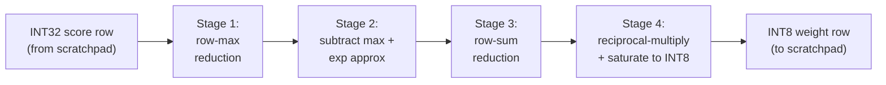

# Vector and Softmax

Status: spec frozen (Sprint 02)

## Scope

Specify the vector unit that performs row-wise softmax and helper reductions for the attention datapath. The unit processes INT32 score rows from the MAC array and produces INT8 normalized weight rows for the value-phase MATMUL.

## Architecture decision: dedicated softmax pipeline

A dedicated four-stage softmax pipeline is chosen over staged vector micro-ops. This avoids scheduler complexity from multi-instruction softmax sequences and keeps the ISA surface simple (single `SOFTMAX` command).

## Softmax decomposition

The hardware implements row-wise softmax on INT32 score vectors of up to 64 elements (one tile row):

### Stage 1: Row-max reduction

- Reads N elements (up to 64) from scratchpad in chunks of 16 per cycle.
- Computes running maximum across all chunks using a 16-wide comparison tree.
- Latency: `ceil(N/16)` cycles to read + 1 cycle for final max.
- Output: `row_max` (INT32).

### Stage 2: Subtract-and-exponentiate

- For each element: `shifted = score[i] - row_max` (always <= 0).
- Apply exp approximation to `shifted` (see approximation section).
- Processes 16 elements per cycle.
- Output: 16 approximate exp values per cycle (16-bit fixed-point, Q8.8 format).

### Stage 3: Row-sum reduction

- Accumulates the sum of all exp values across the row.
- Uses a 16-wide adder tree followed by a running accumulator.
- Latency: `ceil(N/16)` cycles + 1 cycle for final sum.
- Output: `row_sum` (32-bit fixed-point).

### Stage 4: Reciprocal-multiply and output formatting

- Computes `weight[i] = exp_value[i] * (1/row_sum)`.
- Reciprocal via lookup table: 256-entry LUT maps 8 MSBs of `row_sum` to a Q0.16 reciprocal.
- Multiply: 16-bit x 16-bit -> 32-bit, take upper 8 bits.
- Saturate to INT8 range [-128, 127] (though softmax outputs are non-negative, saturation is defensive).
- Processes 16 elements per cycle.
- Output: 16 x INT8 weight values to scratchpad.

## Exp approximation

### Chosen approach: shift-add with LUT correction

The approximation targets `exp(x)` for `x` in [-255, 0] (the range of `score - max` for INT32 inputs after the max subtraction, clamped for practical hardware).

Method:
1. **Coarse**: `x_int = floor(x / ln2)`, `frac = x - x_int * ln2`. Compute `2^x_int` by right-shifting.
2. **Fine**: 32-entry LUT maps the 5 MSBs of `frac` to a Q0.8 correction factor.
3. **Combine**: `exp_approx = (LUT[frac_msbs] >> (-x_int))`.

For very negative inputs (x < -16), the result is clamped to zero, avoiding underflow.

### Numeric target

- Cosine similarity > 0.99 between hardware softmax output and float softmax reference on the same INT32 input scores.
- Max absolute error < 0.05 per element (on Q0.8 scale).
- These targets are validated by the Sprint 05 verification tests.

## Temporary storage

Intermediate values (`row_max`, partial `row_sum`, exp values between stages 2 and 3) are stored in a **local register file** inside the vector unit, not in scratchpad:

| Register | Width | Count | Purpose |
| --- | --- | --- | --- |
| `row_max` | 32 | 1 | Current row maximum |
| `row_sum` | 32 | 1 | Running exp sum |
| `exp_buf` | 16 | 64 | Buffered exp values (one full row) |

Total: 64 x 16 + 2 x 32 = 1,088 bits = 136 bytes of local state per active softmax operation. This avoids scratchpad port pressure during softmax and keeps the operation self-contained.

## Vector unit interface

| Signal | Dir | Width | Description |
| --- | --- | --- | --- |
| `clk` | in | 1 | Clock |
| `rst_n` | in | 1 | Active-low synchronous reset |
| `cmd_valid` | in | 1 | Scheduler issues softmax command |
| `cmd_ready` | out | 1 | Unit can accept command |
| `cmd_src_slot` | in | 5 | Source tile slot (INT32 scores) |
| `cmd_dst_slot` | in | 5 | Destination tile slot (INT8 weights) |
| `cmd_rows` | in | 8 | Number of rows (tile_m) |
| `cmd_cols` | in | 8 | Number of columns per row (tile_n) |
| `cmd_approx` | in | 1 | 1 = use LUT exp, 0 = reserved for higher-precision mode |
| `done` | out | 1 | All rows complete |
| `busy` | out | 1 | Unit is processing |
| `scratch_req` | out | 8 | Per-bank request bitmap to arbiter |
| `scratch_addr` | out | 14 | Bank-local address |
| `scratch_wen` | out | 1 | Write enable |
| `scratch_wdata` | out | 8 | Write data (INT8 output) |
| `scratch_rdata` | in | 8 | Read data (INT8 from score bytes) |
| `scratch_grant` | in | 8 | Per-bank grant from arbiter |

### Processing flow per row

1. Read N elements from `cmd_src_slot` row (4 bytes per INT32 element, 16 bytes per cycle = 4 elements per cycle for INT32 reads). Latency: `ceil(N/4)` cycles.
2. Stage 1: max reduction over read elements. Pipelined with reads.
3. Re-read and compute subtract + exp (Stage 2). Latency: `ceil(N/4)` cycles.
4. Stage 3: sum reduction over exp values (from local buffer). Latency: `ceil(N/16)` cycles.
5. Stage 4: reciprocal-multiply and write N INT8 outputs to `cmd_dst_slot`. Latency: `ceil(N/16)` cycles.

Total per-row latency: approximately `2*ceil(N/4) + 2*ceil(N/16)` cycles. For N=64: `2*16 + 2*4 = 40` cycles per row. For a 64x64 tile: ~2,560 cycles.

## Verification plan

| Test category | Method | Sprint |
| --- | --- | --- |
| Row-max reduction correctness | Directed cocotb: known inputs, verify max | 05 |
| Exp approximation accuracy | Directed cocotb: compare against Python exp, check cosine > 0.99 | 05 |
| Full softmax row | Directed cocotb: compare against `reference_attention.softmax()` | 05 |
| Saturation and clamp on large negatives | Directed cocotb: score = -10000, verify output = 0 | 05 |
| All-equal scores | Directed cocotb: verify uniform output | 05 |
| Single-hot score | Directed cocotb: one large, rest zero, verify near-one-hot output | 05 |
| Tile-level softmax | Directed cocotb: 64x64 tile, compare against golden model | 05 |
| Numeric cosine threshold | Automated: assert cosine > 0.99 across random score matrices | 05 |
| Backpressure from arbiter | Constrained-random: toggle scratch_grant | 05 |
